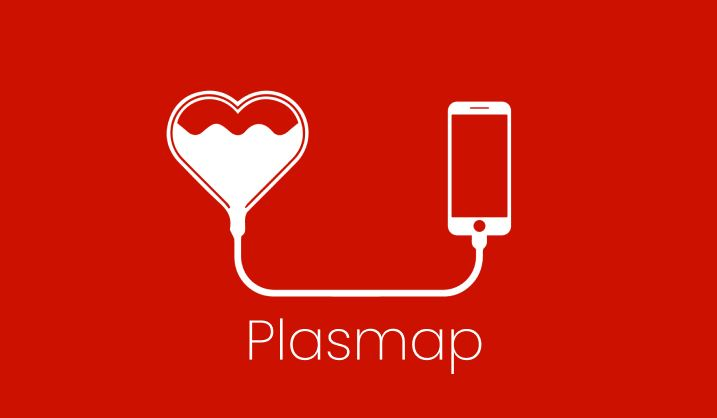

<h1 align="center">
    
</h1>

# PLASMAP - Frontend
A platform to help persons to find blood donations   

[![Project Version][version-image]][version-url]
[![Node][Node]][Node]
### Technologies 
* [NODE-JS]
* [ReactJs]
* [Mui]
* [Webpack]

### Features 
- [x] Architeture
- [x] Menu
- [ ] Footer
- [X] Home Page
- [X] How it Work
- [ ] Json file Hemocentros
- [ ] Geolocation
- [ ] Connect with NoSql
- [ ] CI/CD
- [ ] About Us
- [ ] Logged Area
- [ ] Ask for Donation
- [ ] Registration of Donations
- [ ] History
- [ ] Donation Reminder
## Group

[version-image]: https://img.shields.io/badge/Version-1.0.0-lightblue?style=for-the-badge
[version-url]: https://img.shields.io/badge/version-1.0.0-blue
[Node]: https://img.shields.io/badge/ReactJs17%2B-gray?style=for-the-badge&logo=react
[NODE-JS]: https://nodejs.org/en/
[ReactJs]: https://reactjs.org/
[Mui]: https://mui.com/pt/
[Webpack]: https://webpack.js.org/

